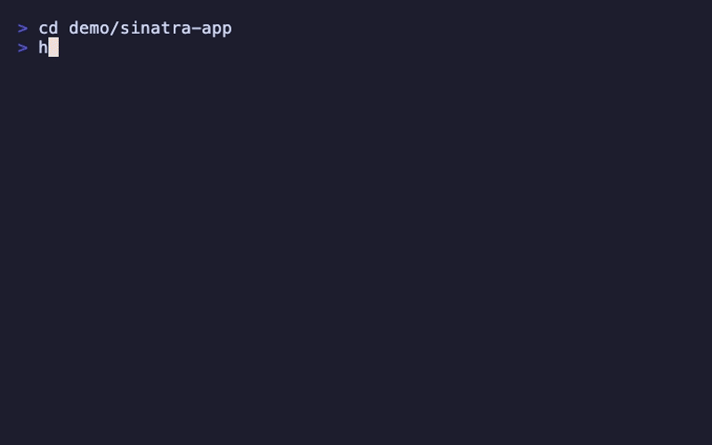

# hdi - "How do I..."

_"...run this thing"_.

Scan a project's README and extract the commands you (probably) need to get it running. No more opening up the whole project in your editor and scrolling through docs to find the `install`, `run` and `test` steps.

```
$ cd some-project
$ hdi
[hdi] some-project

 ▸ Installation
  ▶ npm install
    cp .env.example .env

 ▸ Run
    npm run dev

  ↑↓ navigate  ⏎ execute  c copy  q quit
```

Arrow keys to navigate, Enter to execute, `q` to quit.

## Example



## Install

### Homebrew (macOS/Linux)

```bash
brew install grega/tap/hdi
```

### Manual

```bash
mkdir -p ~/.local/bin
curl -fsSL https://raw.githubusercontent.com/grega/hdi/main/hdi -o ~/.local/bin/hdi
chmod +x ~/.local/bin/hdi
```

Make sure `~/.local/bin` is on your `$PATH`.

## Usage

```
hdi                    Interactive picker (default)
hdi install            Just install/setup commands (aliases: setup, i)
hdi run                Just run/start commands (aliases: start, r)
hdi test               Just test commands (alias: t)
hdi all                All sections (aliases: a)
hdi /path/to/project   Scan a different directory
hdi /path/to/file.md   Parse a specific markdown file
```

Short forms:

```
hdi i                  Install/setup commands
hdi r                  Run/start commands
hdi t                  Test commands
hdi a                  All sections
```

### Flags

```
-h, --help               Show help
-v, --version            Show version
-f, --full               Show surrounding prose, not just commands
    --raw                Plain markdown output (no colour, for piping)
    --ni, --no-interactive   Non-interactive (just print, no picker)
```

Example: `hdi --raw | pbcopy` to copy commands to clipboard.

### Interactive controls

| Key | Action |
|-----|--------|
| `↑` `↓` / `k` `j` | Navigate commands |
| `Enter` | Execute highlighted command |
| `c` | Copy highlighted command to clipboard |
| `q` / `Esc` | Quit |

## How it works

`hdi` parses a given README's Markdown headings looking for keywords like *install*, *setup*, *prerequisites*, *run*, *usage*, *getting started*, etc. It extracts the fenced code blocks from matching sections (skipping JSON/YAML response examples) and presents them as an interactive, executable list.

Also looks for `README.rst` / `readme.rst`, though Markdown READMEs work best.

No dependencies, just Bash. Should work on macOS and Linux.

## Testing

Tests use [bats-core](https://github.com/bats-core/bats-core). Linting uses [ShellCheck](https://www.shellcheck.net/).

```bash
brew install bats-core shellcheck  # or: apt-get install bats shellcheck
shellcheck hdi
bats test/hdi.bats
```

### Running Linux tests locally with Act

This assumes that the host system is macOS.

CI runs tests on both macOS and Ubuntu. To run the Ubuntu job locally using [Act](https://github.com/nektos/act) (requires Docker / Docker Desktop):

```bash
brew install act
act -j test --matrix os:ubuntu-latest --container-architecture linux/amd64
```

## Demo

The demo GIF is generated with [VHS](https://github.com/charmbracelet/vhs). To regenerate it:

```bash
brew install vhs
vhs ./demo/demo.tape
```

This outputs `demo.gif` from the tape file.

## Benchmarking

Static benchmark READMEs in `bench/` (small, medium, large, stress) exercise every parsing path at different scales. Run benchmarks with:

```bash
./bench/run              # run benchmarks, print results
./bench/run --log        # also save to bench/results.csv (should only be used by release script / run when creating a new release)
```

Benchmarks run automatically during `./release` and are recorded in `bench/results.csv`.

## Publishing a new release

The `release` script bumps the version in `hdi`, commits, tags, pushes, and prints the sha256 for the Homebrew tap:

```bash
./release patch          # 0.1.0 → 0.1.1
./release minor          # 0.1.0 → 0.2.0
./release major          # 0.1.0 → 1.0.0
./release 1.2.3          # explicit version
```

The `release` workflow will automatically build and publish a GitHub release when the tag is pushed. The script then prints the `url` and `sha256` values to update in the [homebrew-tap](https://github.com/grega/homebrew-tap) repo (`Formula/hdi.rb`).

## License

[MIT](LICENSE)
