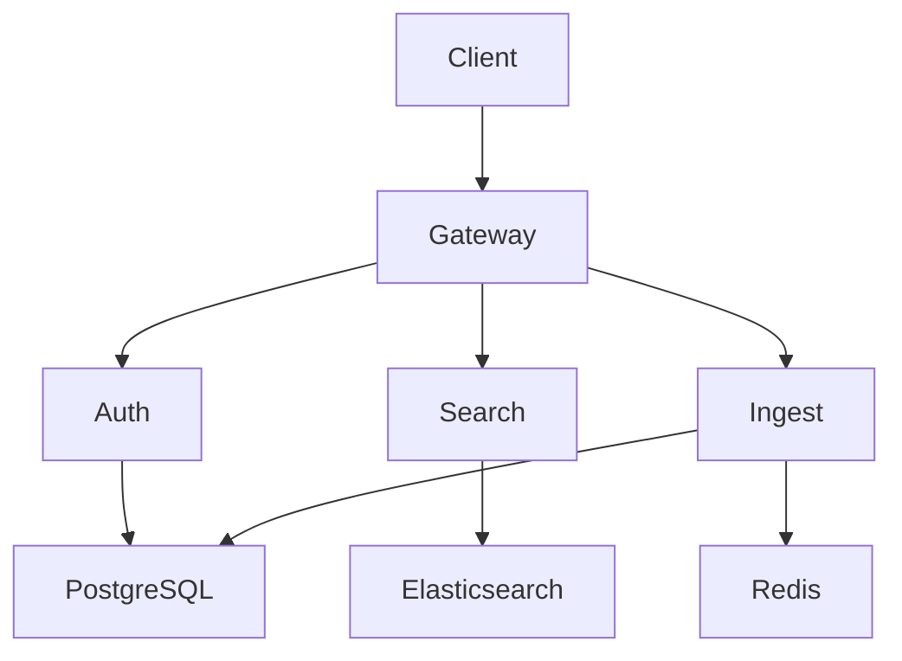

# large-platform

A microservices platform with multiple runtimes, build systems, and deployment targets.

## Prerequisites

You will need the following installed:

- Docker 24+ and Docker Compose v2
- Node.js 20+ (recommend using `nvm install 20`)
- Python 3.12+ (recommend using `pyenv install 3.12`)
- Go 1.22+
- Rust (latest stable via `rustup update stable`)
- PostgreSQL 16+, Redis 7+, Elasticsearch 8+
- Protocol Buffers compiler (`brew install protobuf`)
- Just command runner (`cargo install just`)

## How to Install

### Step 1: Clone and Bootstrap

```bash
git clone --recurse-submodules https://github.com/example/large-platform.git
cd large-platform
just bootstrap
```

### Step 2: Environment Configuration

Copy the example config:

```bash
cp .env.example .env
```

The default configuration:

```yaml
services:
  postgres:
    image: postgres:16
    ports:
      - "5432:5432"
  redis:
    image: redis:7-alpine
    ports:
      - "6379:6379"
  elasticsearch:
    image: elasticsearch:8.12.0
    ports:
      - "9200:9200"
```

### Step 3: Install Dependencies

Install all service dependencies:

```bash
just install-all
```

Or install per-service:

```bash
# API Gateway (Node.js)
cd services/gateway && npm install && cd ../..

# Auth service (Python)
cd services/auth && pip install -r requirements.txt && cd ../..

# Search service (Go)
cd services/search && go mod download && cd ../..

# Ingest pipeline (Rust)
cd services/ingest && cargo fetch && cd ../..
```

### Step 4: Database Setup

Run migrations and seed data:

```bash
just db-setup
```

Which runs:

```console
$ python services/auth/manage.py migrate
Operations to perform:
  Apply all migrations...
Running migrations:
  Applying auth.0001_initial... OK
  Applying auth.0002_add_roles... OK
$ python services/auth/manage.py seed --env=dev
Created 10 test users
Created 3 admin accounts
```

### Step 5: Generate Protobuf Stubs

The services communicate via gRPC. Generate the stubs:

```bash
just proto-gen
```

Proto definitions:

```proto
syntax = "proto3";
package platform.v1;

service AuthService {
  rpc Authenticate(AuthRequest) returns (AuthResponse);
  rpc Refresh(RefreshRequest) returns (AuthResponse);
}

message AuthRequest {
  string email = 1;
  string password = 2;
}
```

## Running the Platform

### Quick Start (Docker)

The fastest way to run everything:

```bash
docker compose up --build
```

### Local Development

Start infrastructure:

```bash
docker compose up -d postgres redis elasticsearch
```

Then start each service. In separate terminals:

```bash
# Terminal 1: API Gateway
cd services/gateway
npm run dev
```

```bash
# Terminal 2: Auth Service
cd services/auth
python manage.py runserver 0.0.0.0:8001
```

```bash
# Terminal 3: Search Service
cd services/search
go run ./cmd/server --port=8002
```

```bash
# Terminal 4: Ingest Pipeline
cd services/ingest
cargo run -- --port 8003
```

Or use the Just recipe:

```bash
just dev
```

### Make Targets

Legacy make targets are still supported:

```bash
make run-gateway
make run-auth
make run-search
make run-all
```

### Available Scripts

The gateway service provides these npm scripts:

| Command | Description |
| --- | --- |
| `npm run dev` | Start dev server with hot reload |
| `npm run build` | Production build |
| `npm run lint` | Run ESLint |
| `npm run typecheck` | Run TypeScript checks |

## Testing

### Unit Tests

```bash
# All services
just test

# Individual services
cd services/gateway && npm test
cd services/auth && pytest
cd services/search && go test ./...
cd services/ingest && cargo test
```

### Integration Tests

Integration tests require running infrastructure:

```bash
docker compose up -d postgres redis elasticsearch
just test-integration
```

```console
$ just test-integration
Running auth integration tests...
============ 48 passed in 12.4s ============
Running search integration tests...
ok  	platform/search/integration	14.221s
Running gateway integration tests...
Tests: 31 passed, 31 total
```

### End-to-End Tests

~~~bash
just test-e2e
~~~

Or run with Playwright directly:

~~~bash
cd e2e
npx playwright test
~~~

### Load Testing

```bash
just load-test
```

Results output:

```text
Requests      [total, rate, throughput]  10000, 500.05, 498.12
Duration      [total, attack, wait]     20.075s, 19.998s, 77.234ms
Latencies     [min, mean, 50, 90, 95, 99, max]  2.1ms, 15.4ms, 12.1ms, 28.3ms, 35.1ms, 78.2ms, 312.4ms
Success       [ratio]  99.87%
```

## Build

### Development Build

```bash
just build-dev
```

### Production Build

Build all service images:

```bash
just build-prod
```

Which runs:

```bash
docker build -t platform/gateway:latest services/gateway/
docker build -t platform/auth:latest services/auth/
docker build -t platform/search:latest services/search/
docker build -t platform/ingest:latest services/ingest/
```

### Compilation Notes

The Rust ingest service uses release optimizations:

```bash
cd services/ingest
cargo build --release
```

The Go search service cross-compiles for Linux:

```bash
cd services/search
GOOS=linux GOARCH=amd64 go build -o bin/server ./cmd/server
```

## Configuration

### Service Configuration

```json
{
  "gateway": {
    "port": 8000,
    "cors": ["http://localhost:3000"],
    "rateLimit": { "window": "1m", "max": 100 }
  }
}
```

### Logging

```yaml
logging:
  level: info
  format: json
  outputs:
    - stdout
    - file: /var/log/platform/app.log
```

### Monitoring

The Grafana dashboard:

```ini
[server]
http_port = 3001
domain = localhost

[database]
type = sqlite3
path = grafana.db
```

Prometheus rules:

```diff
- alert: HighLatency
-   expr: http_request_duration_seconds > 1
+ alert: HighLatency
+   expr: http_request_duration_seconds > 0.5
```

## Deployment

### Staging

```bash
just deploy-staging
```

### Production

Deploy with Helm:

```bash
helm upgrade --install platform ./helm/platform \
  --namespace production \
  --set image.tag=$(git rev-parse --short HEAD) \
  --set replicas.gateway=3 \
  --set replicas.auth=2 \
  --values helm/production-values.yaml
```

Or with kubectl directly:

```bash
kubectl apply -f k8s/namespace.yaml
kubectl apply -f k8s/secrets.yaml
kubectl apply -f k8s/deployments/
kubectl apply -f k8s/services/
```

Verify the deployment:

```console
$ kubectl get pods -n production
NAME                        READY   STATUS    RESTARTS   AGE
gateway-7d8f9b6c4-abc12    1/1     Running   0          2m
gateway-7d8f9b6c4-def34    1/1     Running   0          2m
auth-5c4d3b2a1-ghi56       1/1     Running   0          2m
search-8e7f6d5c4-jkl78     1/1     Running   0          2m
ingest-1a2b3c4d5-mno90     1/1     Running   0          2m
```

### Rollback

```bash
helm rollback platform 1 --namespace production
```

## Architecture

Architecture diagram:



## Troubleshooting

### Common Issues

Reset everything and start fresh:

```bash
just clean
docker compose down -v
just bootstrap
```

Rebuild a single service:

```bash
docker compose build --no-cache gateway
docker compose up -d gateway
```

Check service health:

```bash
curl -s http://localhost:8000/health | python -m json.tool
```

## License

Apache 2.0
