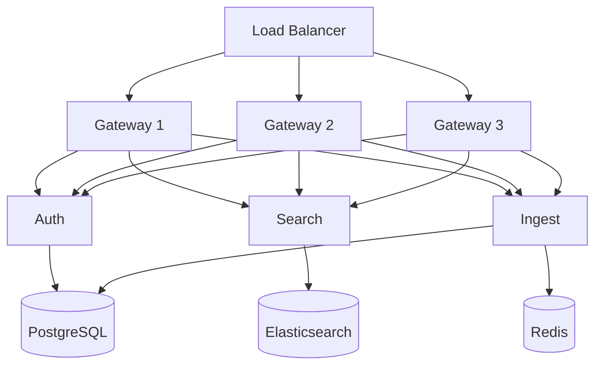

# stress-test

A synthetic README that exercises every parsing path at scale.

## Prerequisites

- Node 20+ (use `nvm install 20`)
- Python 3.12+ (use `pyenv install 3.12`)
- Go 1.22+
- Rust stable (use `rustup update stable`)
- Docker 24+
- Just (`cargo install just`)
- Mise (`curl https://mise.run | sh`)

Install system dependencies with `brew install protobuf cmake libpq openssl`.

Use `pip install pre-commit` then `pre-commit install` for hooks.

## Installation

```bash
git clone https://github.com/example/stress.git
cd stress
```

```bash
npm install
```

```bash
pip install -r requirements.txt
```

```bash
go mod download
```

```bash
cargo fetch
```

~~~bash
mix deps.get
~~~

~~~bash
composer install
~~~

```bash
bundle install
```

```bash
flutter pub get
```

    pip install -e ".[dev]"
    pip install -r requirements-test.txt

## Quick Start

```console
$ npm run bootstrap
Installing dependencies...
Building shared packages...
Done in 12.4s
$ npm run dev
Starting gateway on :3000
Starting worker on :3001
```

## Dependencies

Runtime dependencies:

```json
{
  "express": "^4.18.0",
  "pg": "^8.11.0",
  "redis": "^4.6.0",
  "winston": "^3.11.0",
  "zod": "^3.22.0"
}
```

Dev dependencies:

```json
{
  "typescript": "^5.3.0",
  "vitest": "^1.2.0",
  "eslint": "^8.56.0",
  "prettier": "^3.2.0"
}
```

Python dependencies:

```yaml
dependencies:
  - django>=5.0
  - celery>=5.3
  - redis>=5.0
  - psycopg2-binary>=2.9
```

## Set Up

### Database Migrations

```bash
python manage.py migrate
```

```bash
python manage.py createsuperuser \
  --username admin \
  --email admin@example.com
```

```bash
python manage.py seed \
  --count 1000 \
  --env development
```

### Cache Setup

```bash
redis-cli ping
```

### Search Index

```bash
curl -X PUT http://localhost:9200/documents \
  -H "Content-Type: application/json" \
  -d '{
    "settings": { "number_of_shards": 1 },
    "mappings": {
      "properties": {
        "title": { "type": "text" },
        "body": { "type": "text" }
      }
    }
  }'
```

### Protobuf Generation

```bash
just proto-gen
```

Proto schema:

```proto
syntax = "proto3";
package stress.v1;

service DocumentService {
  rpc Create(CreateRequest) returns (Document);
  rpc Search(SearchRequest) returns (SearchResponse);
  rpc Delete(DeleteRequest) returns (Empty);
}

message Document {
  string id = 1;
  string title = 2;
  string body = 3;
  int64 created_at = 4;
}
```

## Running

### Docker

```bash
docker compose up --build -d
```

```bash
docker compose logs -f gateway
```

### Local Development

```bash
npm run dev
```

```bash
python manage.py runserver
```

```bash
go run ./cmd/server
```

```bash
cargo run
```

~~~bash
mix phx.server
~~~

```bash
just dev-all
```

### Scripts

| Command | Description |
| --- | --- |
| `npm run dev` | Start gateway in dev mode |
| `npm run build` | Production build |
| `npm run lint` | Lint all packages |
| `npm run typecheck` | TypeScript type checking |
| `npm run format` | Format with Prettier |

| Command | Description |
| --- | --- |
| `just dev-all` | Start all services |
| `just build-prod` | Production build |
| `just test` | Run all tests |
| `just lint` | Lint everything |
| `just clean` | Clean all artifacts |
| `just proto-gen` | Regenerate protobuf stubs |

### Make Targets

```bash
make dev
make build
make test
make lint
make clean
make docker-build
make docker-push
make deploy-staging
make deploy-prod
```

## Testing

### Unit Tests

```bash
npm test
```

```bash
pytest tests/unit/
```

```bash
go test ./...
```

```bash
cargo test
```

~~~bash
mix test
~~~

### Integration Tests

```bash
docker compose up -d postgres redis elasticsearch
pytest tests/integration/ -x -v
```

```console
$ pytest tests/integration/ -x -v
tests/integration/test_auth.py::test_login PASSED
tests/integration/test_auth.py::test_register PASSED
tests/integration/test_auth.py::test_refresh PASSED
tests/integration/test_documents.py::test_create PASSED
tests/integration/test_documents.py::test_search PASSED
tests/integration/test_documents.py::test_delete PASSED
============ 6 passed in 4.21s ============
```

### End-to-End Tests

```bash
npx playwright test
```

```bash
npx playwright test --ui
```

### Load Tests

```bash
just load-test --duration 60s --rate 500
```

Results:

```text
Requests      [total, rate, throughput]  30000, 500.02, 497.88
Duration      [total, attack, wait]     60.254s, 59.998s, 256.1ms
Latencies     [min, mean, 50, 90, 95, 99, max]  1.8ms, 12.6ms, 9.4ms, 24.1ms, 32.8ms, 68.4ms, 289.1ms
Success       [ratio]  99.93%
Status Codes  [code:count]  200:29979  429:21
```

### Coverage

```bash
pytest --cov=app --cov-report=html
open htmlcov/index.html
```

```bash
go test -coverprofile=cover.out ./...
go tool cover -html=cover.out
```

## Build

### Development

```bash
just build-dev
```

### Production

```bash
docker build \
  -t stress/gateway:latest \
  -f services/gateway/Dockerfile \
  --build-arg NODE_ENV=production \
  .
```

```bash
docker build \
  -t stress/auth:latest \
  -f services/auth/Dockerfile \
  --target production \
  .
```

```bash
cd services/search
CGO_ENABLED=0 GOOS=linux GOARCH=amd64 \
  go build -ldflags="-s -w" -o bin/server ./cmd/server
```

```bash
cd services/ingest
cargo build --release --target x86_64-unknown-linux-musl
```

### Compilation

```bash
npm run build
```

```bash
tsc --build tsconfig.json
```

## Configuration

Application config:

```json
{
  "port": 3000,
  "database": {
    "host": "localhost",
    "port": 5432,
    "name": "stress_dev",
    "pool": { "min": 2, "max": 10 }
  },
  "redis": { "url": "redis://localhost:6379/0" },
  "elasticsearch": { "node": "http://localhost:9200" }
}
```

```yaml
logging:
  level: info
  format: json
  transports:
    - type: console
    - type: file
      path: /var/log/stress/app.log
      maxSize: 50m
      maxFiles: 5
```

```toml
[server]
host = "0.0.0.0"
port = 8000
workers = 4

[database]
url = "postgres://localhost/stress"
pool_size = 10

[cache]
backend = "redis"
url = "redis://localhost:6379/0"
ttl = 3600
```

```ini
[uwsgi]
module = app.wsgi:application
master = true
processes = 4
threads = 2
socket = /tmp/stress.sock
```

```xml
<configuration>
  <appSettings>
    <add key="DatabaseConnection" value="Server=localhost;Database=stress;" />
    <add key="CacheExpiry" value="3600" />
  </appSettings>
</configuration>
```

```env
DATABASE_URL=postgres://localhost/stress
REDIS_URL=redis://localhost:6379
SECRET_KEY=dev-secret-key-change-in-production
ALLOWED_HOSTS=localhost,127.0.0.1
DEBUG=true
```

```csv
service,port,replicas,memory_limit
gateway,3000,3,512Mi
auth,8001,2,256Mi
search,8002,2,1Gi
ingest,8003,1,2Gi
```

## Deploy

### Staging

```bash
just deploy-staging
```

### Production

```bash
helm upgrade --install stress ./helm/stress \
  --namespace production \
  --set image.tag=$(git rev-parse --short HEAD) \
  --set gateway.replicas=3 \
  --set auth.replicas=2 \
  --values helm/production-values.yaml
```

```bash
kubectl apply -f k8s/namespace.yaml
kubectl apply -f k8s/configmaps/
kubectl apply -f k8s/secrets/
kubectl apply -f k8s/deployments/
kubectl apply -f k8s/services/
kubectl apply -f k8s/ingress.yaml
```

```console
$ kubectl get pods -n production
NAME                        READY   STATUS    RESTARTS   AGE
gateway-7d8f9b6c4-x1y2z    1/1     Running   0          30s
gateway-7d8f9b6c4-a3b4c    1/1     Running   0          30s
gateway-7d8f9b6c4-d5e6f    1/1     Running   0          30s
auth-5c4d3b2a1-g7h8i       1/1     Running   0          30s
auth-5c4d3b2a1-j9k0l       1/1     Running   0          30s
search-8e7f6d5c4-m1n2o     1/1     Running   0          30s
search-8e7f6d5c4-p3q4r     1/1     Running   0          30s
ingest-1a2b3c4d5-s5t6u     1/1     Running   0          30s
```

### Rollback

```bash
helm rollback stress --namespace production
```

```bash
kubectl rollout undo deployment/gateway -n production
```

## Architecture



## Troubleshooting

Reset the local environment:

```bash
just clean
docker compose down -v
docker system prune -f
just bootstrap
```

Check service health:

```bash
curl -sf http://localhost:3000/health
curl -sf http://localhost:8001/health
curl -sf http://localhost:8002/health
curl -sf http://localhost:8003/health
```

Debug database connections:

```bash
psql -h localhost -U stress -d stress_dev -c "SELECT count(*) FROM pg_stat_activity;"
```

Tail all logs:

```bash
docker compose logs -f --tail=100
```

## License

Apache 2.0
